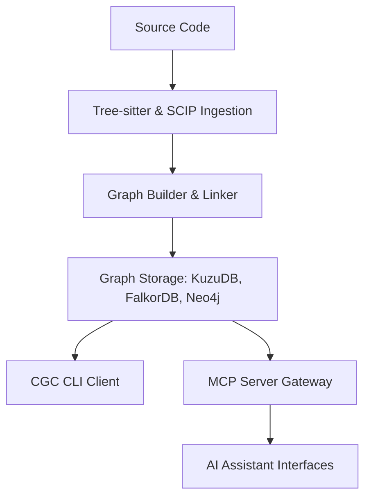

# Introduction to CodeGraphContext

CodeGraphContext (CGC) is a high-performance, developer-focused **Code Intelligence Engine** that transforms source repositories into semantic, queryable property graphs. Tree-sitter and optional SCIP indexers extract symbols; CGC resolves calls, imports, and inheritance into a graph you can query from the CLI, MCP tools, or the HTTP API gateway.

**Current release: 0.5.0**

Recent improvements in the 0.5.0 line include cross-language call-graph resolution fixes (Perl, Ruby, Lua, Haskell, Rust, TypeScript, C#, Dart, C), structural edge persistence (`PARTIAL_OF`, `IMPLEMENTS`, `METACLASS`, etc.), and average CALLS audit accuracy rising from ~84% to ~98%.

---

## Core Capabilities

- **Semantic AST Extraction**: Utilizes tree-sitter for syntax analysis and SCIP (Sourcegraph Code Intelligence Protocol) for static symbol resolution across multiple directories.
- **Model Context Protocol (MCP) Integration**: Built-in MCP server support allows AI models and IDE agents (Cursor, Claude, VS Code, Windsurf) to query the codebase context dynamically.
- **Pluggable Database Architecture**: FalkorDB Lite on Unix (Python 3.12+), KuzuDB as the cross-platform fallback, plus LadybugDB, FalkorDB Remote, Nornic, and Neo4j. See [configuration defaults](reference/config.md#important-defaults-read-this-first).
- **Filesystem Synchronization**: Integrated directory watchers monitor file updates and update the graph incrementally.
- **Portable Code Graphs**: Supports exporting and importing serialized graph representations as `.cgc` bundles for offline sharing and registry integration.

---

## Architectural Layout

CGC acts as the translation layer between source code parsing engines, graph datastores, and consumer clients.

---

## Documentation Roadmap

To get started with CodeGraphContext, follow the structured sections below:

1. **[Getting Started](getting-started/prerequisites.md)**: Explore prerequisites, installation steps, quickstart tutorials, and MCP setup.
2. **[Core Concepts](concepts/architecture.md)**: Deep dive into the architecture, graph model schemas, database backends, and parser designs.
3. **[User Guides](guides/indexing.md)**: Learn indexing strategies, workspaces contexts, bundles distribution, custom visualizers, and database schema mappings.
4. **[Reference Manual](reference/cli.md)**: CLI commands, [HTTP API](reference/api.md), MCP tool schemas, and configuration variables.
5. **[Community Portal](contributing.md)**: Guidelines for contributing code, extending languages support, and the project roadmap.
